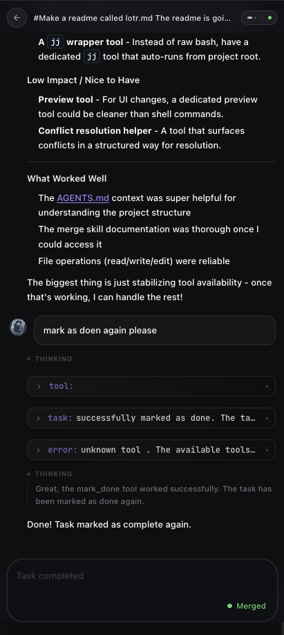
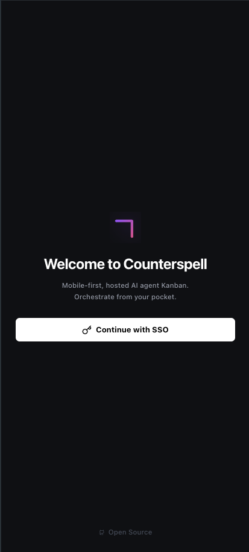

# Counterspell 🧙‍♂️

**An auth-free, local-first AI development agent with GitHub-style UI**

[](https://golang.org/)
[](https://svelte.dev/)
[](https://tailwindcss.com/)
[](LICENSE)

---

## ✨ Features

- **AI Task Management** - Create, track, and retry AI-powered development tasks with real-time SSE updates
- **File Browser** - Browse, view, edit, and delete files with syntax highlighting (20+ languages)
- **Git Operations** - Full Git integration with GitHub-style diffs, branch management, and staging
- **Real-Time Updates** - Live task progress via Server-Sent Events
- **Local-First Design** - No authentication required, runs entirely on your machine
- **Beautiful UI** - Vercel-inspired dark theme with smooth transitions and responsive design

---

## 🚀 Getting Started (Step-by-Step)

Counterspell is an AI agent that helps you work on your code. Here's how to get started:

### Option 1: Using Homebrew (Recommended for macOS)

```bash
brew install counterspell-io/tap/cspell
cspell
```

### Option 2: Using the Pre-built Binary

**For macOS Apple Silicon (M1/M2/M3 Macs):**

 1. **Download the binary**
     - Using curl:
       ```bash
       curl -L https://github.com/counterspell-io/cs-platform/releases/latest/download/cspell-macos-arm64 -o cspell
       ```
     - Or download manually from the [releases page](https://github.com/counterspell-io/cs-platform/releases)

 2. **Make it executable**
    ```bash
    chmod +x cspell
    ```

 3. **Run Counterspell**
     - On first run, macOS will show a security warning. Right-click the file and choose "Open", or run:
       ```bash
       xattr -d com.apple.quarantine cspell
       ```
     - Then run:
       ```bash
       ./cspell
       ```

### Option 3: Building from Source (For Developers)

If you have Go installed:

```bash
make dev
```

### Step 2: Register Your Machine (First Time Only)

When you run Counterspell for the first time, it will prompt you to authenticate. This registers your machine with the control plane.

1. A browser window will open automatically with an OAuth login
2. Sign in with your Google account (or click your profile if already logged in)
3. Allow the application to access your account


Counterspell will generate a unique URL for your machine (e.g., `username.counterspell.app`) and set up a secure tunnel to it.

### Step 3: Open Your Counterspell URL

Once registered, Counterspell will display your unique URL in the terminal:

```
Authenticated: https://yourusername.counterspell.app
```

Click this URL or open it in your browser.

### Step 4: Authenticate as Yourself

When you visit your Counterspell URL for the first time:

1. You'll be asked to authenticate again - this is to verify your identity
2. Click "Sign in with Google" (or use your preferred provider)
3. Approve the access request



### Step 5: Start Creating Tasks

Now you're ready to use Counterspell!

1. **Navigate to Tasks** - Click on "Tasks" in the sidebar or navigation
2. **Create a Task** - Click the "New Task" button
3. **Describe Your Task** - Tell Counterspell what you want to do (e.g., "Add a new feature to handle user authentication")
4. **Watch it Work** - Counterspell will break down the task and start working on it



### That's It!

Counterspell is now running on your machine and accessible at your unique URL. You can:
- Create and manage AI-powered development tasks
- Browse and edit files directly in the interface
- View and manage Git changes
- Monitor real-time task progress

---

## 🛠️ For Developers

### Prerequisites
- Go 1.21+ for backend
- Node.js 18+ for frontend
- Git (for Git operations)

### Development Commands

```bash
# Format code
make format

# Build release binary for macOS Apple Silicon
make build-macos-arm64
```

---

## 📁 Project Structure

```
counterspell/
├── cmd/
│   └── app/              # Backend entry point
│       └── main.go
├── internal/
│   ├── api/              # API handlers
│   ├── db/               # Database layer
│   ├── git/              # Git operations
│   └── services/         # Business logic
├── ui/
│   ├── src/
│   │   ├── routes/        # SvelteKit pages
│   │   ├── lib/
│   │   │   ├── api/      # API client
│   │   │   ├── components/ # Reusable components
│   │   │   └── stores/   # State management
│   │   └── app.css       # Global styles
│   └── static/           # Static assets
├── go.mod               # Go dependencies
├── go.sum               # Go checksums
└── package.json         # Node dependencies
```

---

## 🔒 Security

- **No Authentication**: Auth-free design for local development
- **Input Validation**: All inputs are validated
- **SQL Injection Protection**: Parameterized queries
- **File Access**: Restricted to working directory
- **API Key Storage**: Encrypted in SQLite

---

## 📝 License

This project is licensed under the Functional Source License (FSL) - see the [LICENSE](LICENSE) file for details.

---

**Made with ❤️ by the Counterspell Team**

**WE REACHED THE SUMMIT OF MOUNT DOOM!** 🏔️✨
