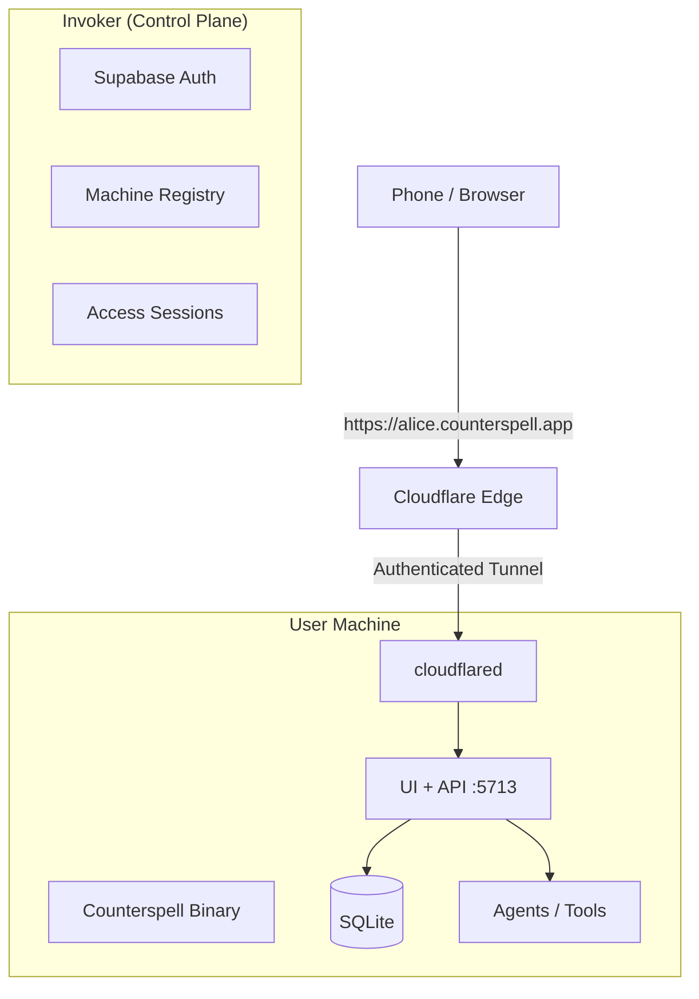

## 1. Abstract

This RFC defines the architecture for **Counterspell**, a local-first coding agent that runs on a user’s machine while being securely accessible from any device via a stable HTTPS subdomain (e.g. `alice.counterspell.app`).

The system is composed of:
- A **Data Plane** (local Counterspell binary)
- A **Control Plane** (Invoker SaaS)
- A **secure, authenticated tunnel** between them

The design prioritizes:
- Local execution and data ownership
- Zero-config remote access
- Strong user authentication before tunnel access
- Minimal cloud-side request handling

---

## 2. Goals & Non-Goals

### 2.1 Goals

- Allow a user to:
  - Run Counterspell locally
  - Access it remotely from a phone or browser
  - Use a stable, human-readable URL
- Require **explicit user authentication** before remote access is granted
- Avoid exposing local services directly to the internet
- Avoid cloud execution of user code or agents
- Make the tunnel establishment feel *automatic and magical*

### 2.2 Non-Goals

- Multi-user shared machines (out of scope for v1)
- Cloud-hosted agent execution
- Long-lived unauthenticated public tunnels
- Invoker having access to source code, repos, or tokens

---

## 3. Terminology

| Term | Definition |
|----|-----------|
| **Counterspell** | Local Go binary providing UI, agents, and APIs |
| **Invoker** | Control Plane SaaS (auth, billing, routing) |
| **Data Plane** | User’s local machine running Counterspell |
| **Control Plane** | Cloud services operated by Counterspell |
| **Tunnel** | Encrypted outbound connection from Data Plane to Edge |
| **Subdomain** | User-facing URL, e.g. `alice.counterspell.app` |

---

## 4. High-Level Architecture

### 4.1 System Overview



---

## 5. Security Model (Key Principle)

> **Possession of a tunnel is not sufficient for access.  
 A valid Invoker user session is required.**

Remote access requires **both**:
1. A live tunnel from the local machine
2. An authenticated user session issued by Invoker

This ensures:
- Tunnel URLs are not “public links”
- Lost or leaked URLs alone are insufficient
- Access can be revoked centrally

---

## 6. Authentication Domains

### 6.1 Control Plane Authentication (Invoker)

- Implemented using **OAuth 2.0 Authorization Code Flow with PKCE**
- Backed by Supabase
- Used for:
  - User identity
  - Billing
  - Machine ownership
  - Tunnel authorization

### 6.2 Data Plane Authentication (Counterspell)

- No standalone user accounts
- Trust is derived from:
  - Possession of a valid tunnel
  - Validated upstream Invoker session headers

Counterspell **never** stores Invoker credentials beyond a machine-scoped token.

---

# 7. Authentication & Tunnel Handshake

_(Handler-Level Specification, Fully Expanded)_

This section defines **all HTTP handlers, background functions, and middleware** required to support authentication, machine registration, tunnel establishment, and authenticated remote access.

---

## 7.1 Counterspell Binary (Data Plane)

All handlers below run **locally on the user’s machine**.

---

### 7.1.1 CLI Login Bootstrap

```go
// counterspell binary
// INTERNAL (invoked during CLI startup, not an HTTP handler)
//
// StartLoginFlow initiates the OAuth 2.0 Authorization Code Flow with PKCE
// against the Invoker Control Plane.
//
// Detailed logic flow:
// 1. Generate PKCE code_verifier (RFC 7636)
// 2. Derive code_challenge using SHA256 + base64url
// 3. Generate cryptographically secure `state` value
// 4. Persist {state, code_verifier, created_at} in SQLite (ephemeral table oauth_login_attempts sqlite)
// 
// oauth_login_attempts (
//    id INTEGER PRIMARY KEY,
//    state TEXT NOT NULL UNIQUE,
//    code_verifier TEXT NOT NULL,
//    created_at INTEGER NOT NULL -- UNIX Milis
//)
// Inserted when startloginflow begins. Dlete on succesfull token exchange or on // timeout
// 5. Call Invoker POST /api/v1/auth/url with:
//    - redirect_uri = http://localhost:8711/auth/callback
//    - code_challenge
//    - state
// 6. Receive auth_url
// 7. Open system browser to auth_url
// 8. Start temporary HTTP server on localhost:8711
// 9. Block until OAuthCallback completes or context is cancelled
//
// Third-party dependencies:
// - crypto/rand (PKCE + state generation)
// - golang.org/x/oauth2 (PKCE helpers, optional)
// - Invoker Control Plane API
//
// Third-party configuration required:
// - None locally
//
// Notes:
// - Only one login flow may exist at a time
// - Callback server binds ONLY to 127.0.0.1
func (a *App) StartLoginFlow(ctx context.Context) error
```

---

### 7.1.2 OAuth Callback Receiver (Local)

```go
// counterspell binary handler
// GET /auth/callback
//
// Handles OAuth redirect from Invoker after successful user login.
//
// Detailed logic flow:
// 1. Parse `code` and `state` query parameters
// 2. Lookup stored state + code_verifier from SQLite
// 3. Reject request if state mismatch or expired
// 4. Call Invoker POST /api/v1/auth/exchange with:
//    - code
//    - code_verifier
//    - state
// 5. Receive:
//    - machine_jwt (machine-scoped, revocable)
//    - user_id
//    - user_email
// 6. Persist machine_jwt securely in SQLite (machine_identity)

//machine_identity (
//    machine_id TEXT PRIMARY KEY,
//    user_id TEXT NOT NULL,
//    subdomain TEXT NOT NULL,
//    tunnel_provider TEXT NOT NULL, -- "cloudflare" (support only 1 for v1)
//    tunnel_token TEXT NOT NULL,
//    created_at INTEGER NOT NULL, -- UNIX Milis
//    last_seen_at INTEGER -- UNIX Milis
// )

// 7. Tear down temporary callback HTTP server
// 8. Notify main process that authentication succeeded
//
// Third-party dependencies:
// - net/http
// - Invoker Control Plane API
//
// Third-party configuration required:
// - Invoker OAuth redirect URI must include:
//   http://localhost:8711/auth/callback
//
// Notes:
// - Requests not from loopback must be rejected
// - No cookies are set here
func (h *Handler) OAuthCallback(w http.ResponseWriter, r *http.Request)
```

---

### 7.1.3 Machine Registration

```go
// counterspell binary
// INTERNAL
//
// RegisterMachine associates the local machine with the authenticated user.
//
// Detailed logic flow:
// 1. Generate or load persistent machine_id (UUID)
// 2. Collect system metadata:
//    - runtime.GOOS
//    - runtime.GOARCH
//    - hostname
//    - counterspell version
// 3. Call Invoker POST /api/v1/machines/register
//    Authorization: Bearer <machine_jwt>
// 4. Receive:
//    - subdomain (e.g. "alice")
//    - cloudflare tunnel token
// 5. Persist values in SQLite
//
// Third-party dependencies:
// - github.com/google/uuid
// - Invoker Control Plane API
//
// Third-party configuration required:
// - None locally
//
// Notes:
// - This call is idempotent per machine_id
// - Subdomain allocation is owned by Invoker
func (a *App) RegisterMachine(ctx context.Context) error
```

---

### 7.1.4 Tunnel Bootstrap

```go
// counterspell binary
// INTERNAL background service
//
// StartTunnel establishes an outbound Cloudflare Tunnel.
//
// Detailed logic flow:
// 1. Check for cloudflared binary on PATH
// 2. If missing:
//    - Download from https://github.com/cloudflare/cloudflared/releases
//    - Verify checksum
//    - Mark executable
// 3. Generate ephemeral tunnel config:
//    - hostname: <subdomain>.counterspell.app
//    - service: http://localhost:5713
// 4. Launch cloudflared with:
//    cloudflared tunnel run --token <tunnel_token>
// 5. Monitor process health
// 6. Restart on transient failure
// 7. Terminate on token revocation or logout
//
// Third-party dependencies:
// - Cloudflare cloudflared binary
// - os/exec
//
// Third-party configuration required:
// - Cloudflare account
// - DNS zone: counterspell.app
// - Tunnel connector permissions enabled
//
// Notes:
// - Tunnel is outbound-only (NAT-safe)
// - No inbound ports are opened
func (a *App) StartTunnel(ctx context.Context) error
```

---

### 7.1.5 Edge Identity Middleware

```go
// counterspell binary middleware
//
// RequireEdgeIdentity validates that a request was authorized by Invoker.
//
// Detailed logic flow:
// 1. Read headers:
//    - X-Counterspell-User-ID
//    - X-Counterspell-Session-ID
// 2. Reject request if missing
// 3. Attach values to request context
// 4. Proceed to handler
//
// Third-party dependencies:
// - None
//
// Notes:
// - Trust boundary begins here
// - This is NOT user authentication
func RequireEdgeIdentity(next http.Handler) http.Handler
```

---

## 7.4 Unified Sequence Diagram (End-to-End)

```
sequenceDiagram
    participant User
    participant Browser
    participant Counterspell
    participant Invoker
    participant Supabase
    participant Cloudflare

    User->>Counterspell: Run counterspell binary
    Counterspell->>Invoker: POST /auth/url (PKCE)
    Invoker->>Browser: Redirect to login
    Browser->>Supabase: OAuth login
    Supabase->>Invoker: Auth code
    Invoker->>Browser: Redirect localhost callback
    Browser->>Counterspell: GET /auth/callback
    Counterspell->>Invoker: POST /auth/exchange
    Invoker->>Counterspell: machine_jwt
    Counterspell->>Invoker: POST /machines/register
    Invoker->>Cloudflare: Create tunnel + DNS
    Cloudflare->>Counterspell: tunnel token
    Counterspell->>Cloudflare: Establish tunnel
    User->>Browser: Open alice.counterspell.app
    Browser->>Invoker: Session validation
    Invoker->>Cloudflare: Allow request
    Cloudflare->>Counterspell: Forward request
    Counterspell->>Browser: Serve UI
```

---

# 8. Invoker Binary — Control Plane (Complete Handler Spec)

---
## 8.1 OAuth & Auth Handlers

### 8.1.1 Create CLI Auth URL

```go
// invoker binary handler
// POST /api/v1/auth/url
//
// Creates an OAuth authorization URL for a Counterspell CLI login.
//
// Detailed logic flow:
// 1. Validate redirect_uri against allowlist
// 2. Persist pending_login record:
//    - state
//    - code_challenge
//    - redirect_uri
//    - created_at
// 3. Generate Supabase OAuth URL with PKCE
// 4. Return auth_url to Counterspell
//
// Third-party dependencies:
// - github.com/supabase-community/supabase-go
//   - client.Auth.SignInWithOAuth()
// - Supabase REST endpoint:
//   POST /auth/v1/authorize
//
// Third-party configuration required:
// - Supabase project
// - OAuth redirect URLs configured:
//   - https://invoker.counterspell.app/auth/callback
//
// Notes:
// - No user authentication occurs here
func (h *Handler) CreateCLIAuthURL(w http.ResponseWriter, r *http.Request)
```

---

### 8.1.2 OAuth Callback (Browser → Invoker)

```go
// invoker binary handler
// GET /auth/callback
//
// Receives OAuth redirect from Supabase after user login.
//
// Detailed logic flow:
// 1. Validate `state` against pending_login
// 2. Exchange authorization code with Supabase
// 3. Create or load user record
// 4. Persist Supabase session temporarily
// 5. Redirect browser to localhost callback URI
//
// Third-party dependencies:
// - Supabase REST:
//   POST /auth/v1/token?grant_type=authorization_code
//
// Third-party configuration required:
// - Supabase redirect URI must include this endpoint
//
// Notes:
// - This endpoint is browser-facing
func (h *Handler) OAuthCallback(w http.ResponseWriter, r *http.Request)
```

---

### 8.1.3 Exchange OAuth Code (CLI)

```go
// invoker binary handler
// POST /api/v1/auth/exchange
//
// Exchanges OAuth code for a machine-scoped JWT.
//
// Detailed logic flow:
// 1. Validate code + state
// 2. Verify Supabase session
// 3. Mint machine-scoped JWT:
//    - subject = machine
//    - user_id
//    - expiration
// 4. Persist machine_auth record
// 5. Return JWT to Counterspell
//
// Third-party dependencies:
// - Supabase Auth validation
// - github.com/golang-jwt/jwt/v5
//
// Third-party configuration required:
// - JWT signing key (Invoker secret)
//
// Notes:
// - JWT is NOT a user session token
func (h *Handler) ExchangeOAuthCode(w http.ResponseWriter, r *http.Request)
```

---

## 8.2 Machine & Tunnel Handlers

---

### 8.2.1 Register Machine

```go
// invoker binary handler
// POST /api/v1/machines/register
//
// Registers a machine and provisions a tunnel.
//
// Detailed logic flow:
// 1. Authenticate request via machine JWT
// 2. Upsert machine record
// 3. Allocate or reuse subdomain
// 4. Create Cloudflare Tunnel via API
// 5. Create DNS record:
//    <subdomain>.counterspell.app
// 6. Generate tunnel token
// 7. Return subdomain + token
//
// Third-party dependencies:
// - Cloudflare REST API
//   POST /client/v4/accounts/:id/cfd_tunnel
//   POST /client/v4/zones/:zone_id/dns_records
//
// Third-party configuration required:
// - Cloudflare account_id
// - zone_id for counterspell.app
//
// Notes:
// - Tunnel ownership is fully server-side
func (h *Handler) RegisterMachine(w http.ResponseWriter, r *http.Request)
```

---

### 8.2.2 Validate Subdomain Access (Edge)

```go
// invoker binary / edge handler
//
// Validates that an incoming request to *.counterspell.app
// is from an authenticated user who owns the subdomain.
//
// Detailed logic flow:
// 1. Extract subdomain from Host header
// 2. Validate Supabase session cookie
// 3. Verify user owns machine/subdomain
// 4. Inject identity headers
// 5. Forward request to tunnel
//
// Third-party dependencies:
// - Supabase GoTrue session verification
//
// Notes:
// - This is the primary trust gate
func RequireUserSession(next http.Handler) http.Handler
```

---

### 8.2.3 Revoke Machine

```go
// invoker binary handler
// POST /api/v1/machines/{machine_id}/revoke
//
// Revokes a machine and its tunnel.
//
// Detailed logic flow:
// 1. Authenticate user session
// 2. Verify machine ownership
// 3. Revoke Cloudflare tunnel
// 4. Delete DNS record
// 5. Mark machine inactive
//
// Third-party dependencies:
// - Cloudflare API
//
// Notes:
// - Causes immediate disconnect
func (h *Handler) RevokeMachine(w http.ResponseWriter, r *http.Request)
```

# 9. Cloudflare Tunnel Architecture (Primer)

## 9.1 What Cloudflare Tunnel Is

Cloudflare Tunnel is an **outbound, mutually authenticated tunnel** that connects a private service to Cloudflare’s edge **without opening inbound ports**.

Key properties:

- No public IP required
- NAT / firewall safe
- TLS-encrypted
- Token-revocable

---

## 9.2 How Counterspell Uses It

- One tunnel per machine
- One hostname per tunnel
- Full HTTP forwarding (not path-based)

```
alice.counterspell.app
  → Cloudflare Edge
    → Tunnel Connector (cloudflared)
      → http://localhost:5713
```

---

## 9.3 Required Cloudflare Configuration

### Account-Level

- Cloudflare account
- Domain: `counterspell.app`

### API Tokens

- Tunnel: Create / Read / Delete
- DNS: Edit

### Tunnel Settings

- Named tunnel per machine
- Token-based auth
- No warp client required

---

## 9.4 Why Cloudflare Tunnel Is a Good Fit

|Requirement|Cloudflare Tunnel|
|---|---|
|NAT-safe|✅|
|No inbound ports|✅|
|Revocable|✅|
|Scales to many users|✅|
|Edge auth integration|✅|

---

## 9.5 Failure & Revocation

- Tunnel token revoked → connection drops instantly
- Machine offline → hostname unreachable
- User logged out → Edge blocks request

---

## 10. Request Flow (Authenticated)

```text
Browser
 → HTTPS alice.counterspell.app
   → Edge checks Invoker session
     → Tunnel (if authorized)
       → Counterspell :5713
         → Agents / Files / Git
```

---

## 11. GitHub Authentication (Explicit Decision)

### 11.1 Location

**GitHub OAuth occurs exclusively in the Data Plane.**

### 11.2 Rationale

- Tokens are repo-scoped
- Used for local git operations
- Must never transit or be stored in Invoker

### 11.3 Optional Control Plane Metadata

Counterspell may optionally notify Invoker:
```json
{
  "github_connected": true,
  "github_username": "alice"
}
```

No secrets are shared.

---

## 12. Revocation & Safety

Invoker can revoke access by:
- Invalidating machine JWT
- Revoking tunnel token
- Disabling user account

Effects:
- Tunnel disconnects
- Subdomain becomes unreachable
- Local binary continues functioning offline

---

## 13. Failure Modes

| Scenario              | Behavior                  |
| --------------------- | ------------------------- |
| Local machine offline | Subdomain shows “Offline” |
| Tunnel drops          | Auto-reconnect            |
| User logged out       | Redirect to login         |
| Token revoked         | Tunnel terminated         |

---

## 14. Future Considerations (Non-Normative)

- Multiple machines per user
- Per-machine subdomains
- Custom domains
- Read-only sharing links
- Session approval prompts (“Allow this device?”)

---

## 15. Summary

This architecture ensures:

- **Local-first execution**
- **Cloud-mediated trust**
- **Zero-config remote access**
- **Strong authentication before tunnel use**

The result is a system where:
> The cloud never runs your code,  
> but it knows *who* is allowed to reach it.

